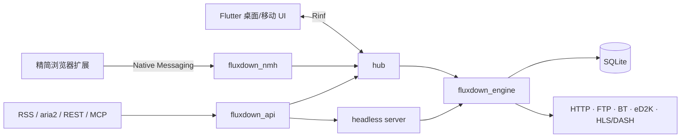

# FluxDown 精简版

FluxDown 精简版是基于 [FluxDown 上游项目](https://github.com/zerx-lab/FluxDown)维护的本地优先多协议下载器。本分支以“下载本身”为中心：保留速度、稳定性、协议、RSS、自动化和浏览器接管，删除 FluxDown 官方云服务、遥测、反馈、在线更新和应用内 JS 插件平台，并逐步清除复杂的资源嗅探/悬浮交互。

> 完整的产品取舍、维护红线与发布验收清单见 [精简版产品边界](.omp/knowledge/streamlined-edition.md)。版本号以 [`pubspec.yaml`](pubspec.yaml) 为准，浏览器扩展版本以 [`fluxDown/package.json`](fluxDown/package.json) 为准。

## 设计目标

- **纯粹下载**：功能必须直接服务下载速度、成功率、协议兼容或任务管理。
- **本地优先**：无需 FluxDown 账号，不上传遥测，不依赖官方云配置。
- **低干扰**：不使用资源嗅探、页面悬浮球或无必要的二次确认。
- **可自动化**：保留 aria2 RPC、REST/MCP、RSS 和浏览器接管。
- **易于维护**：从上游同步下载引擎修复时，不重新带回已移除的云服务和产品入口。

## 保留的核心功能

| 范围 | 功能 |
|---|---|
| 协议 | HTTP/HTTPS、FTP、BitTorrent、磁力、eD2K、HLS/DASH |
| 下载性能 | 动态分段、断点续传、并发与连接控制、代理、限速、本地多 CDN 节点调度 |
| 任务管理 | 队列、分类、计划下载、失败重试、完成后动作、清空已完成任务 |
| 自动化 | aria2 兼容 JSON-RPC、REST/MCP、RSS 订阅、用户脚本 |
| 浏览器 | Chrome/Edge/Firefox 下载接管、右键下载、磁力接管、Native Messaging、下载中任务角标 |
| 数据可靠性 | SQLite 持久化、崩溃恢复、日志、设置导入导出 |
| 自建服务 | 用户主动配置的 headless server 或远程下载地址 |

多 CDN 在这里指下载引擎本地解析并调度同一资源的多个节点，是速度功能，不是 FluxDown 官方 CDN 云服务，因此保留。

## 已移除 / 不属于本分支

- FluxDown 官方登录、账号、设备云同步、远程任务云同步和云配置。
- 遥测、部署统计、设备身份、昵称池及 CDN 数据上报。
- 内置反馈上传、社区/商店推广和无关外链。
- 自动检查更新、后台更新器与更新弹窗。
- 应用内 JS/`.fxplug` 插件市场、安装、启停和设置界面。
- 浏览器页面悬浮球和页面资源面板。App 悬浮球仍是待删除的上游兼容残留，不应继续扩展。
- 浏览器 DOM 媒体扫描、MutationObserver、Fetch/XHR 注入、HLS/DASH 资源嗅探与资源预览。

这里的“应用内扩展功能”与“浏览器扩展”不是同一件事：前者已退出产品面，后者是核心下载入口并继续维护。

## 浏览器扩展

精简版扩展只负责下载接管，不充当媒体嗅探器：

- 保留浏览器下载事件接管、右键发送、磁力链接接管和 Native Messaging。
- 角标显示 FluxDown 中真正处于下载状态的任务数量。
- 保留工具栏状态动画和现有配色。
- 不扫描网页资源，不修改 Fetch/XHR，不注入资源 UI，不显示悬浮球。
- 浏览器启动时不得重建历史下载，也不得形成取消后反复重新下载的循环。

构建扩展：

```powershell
Set-Location fluxDown
npm ci
$env:GITHUB_ACTIONS = 'true'
npm run zip
npm run zip:firefox
```

产物位于 `fluxDown/.output/`。Chrome/Edge 解压后通过“加载已解压的扩展”安装；Firefox 本地包是否可永久安装取决于浏览器的签名策略。

## 无人值守行为

- 启用“跳过二次选择/免打扰”后，aria2 RPC 和 RSS 创建的磁力/种子任务直接采用默认全选，不再弹 BT 文件选择窗口。
- RSS 与浏览器接管均属于核心功能，不因精简云服务或应用内插件而删除。
- 主界面的“清空已完成任务”使用垃圾桶按钮，无确认弹窗，并由“标题栏按钮”设置控制显示。

## 架构



| 模块 | 路径 | 说明 |
|---|---|---|
| Flutter 客户端 | [`lib/`](lib) | 桌面/移动界面与本地设置 |
| Rust 下载引擎 | [`native/engine/`](native/engine) | 协议、分段、队列、持久化 |
| App FFI 宿主 | [`native/hub/`](native/hub) | Rinf 信号与引擎 actor |
| HTTP API | [`native/api/`](native/api) | REST、aria2、MCP 契约 |
| Headless server | [`native/server/`](native/server) | 自建服务端与 Web UI |
| Native Messaging | [`native/nmh/`](native/nmh) | 浏览器扩展到本机 App 的中继 |
| 浏览器扩展 | [`fluxDown/`](fluxDown) | WXT 精简下载接管扩展 |

仓库中可能仍有未暴露的上游旧插件类型或兼容代码。它们属于待清理技术债，不代表精简版承诺恢复插件产品功能。

## Windows 构建与安装包

### 环境要求

- Flutter SDK（满足 `pubspec.yaml` 中的 Dart/Flutter 要求）
- Rust stable 工具链
- Visual Studio 2022 C++ 桌面开发工具
- CMake/Ninja（通常由 Flutter/Visual Studio 环境提供）
- [Inno Setup 6](https://jrsoftware.org/isinfo.php)

### 构建

```powershell
flutter pub get
flutter analyze
cargo check -p hub --lib

# 示例版本应与 pubspec.yaml 保持一致。
powershell -ExecutionPolicy Bypass -File scripts/build_custom_windows.ps1 `
  -Version 0.1.44 `
  -OutputDirectory dist
```

脚本会构建 Windows Release、排除已退役的 `fluxdown_updater.exe`，然后用 Inno Setup 生成 `setup.exe` 安装包。

仅验证安装脚本、复用已有 Release 目录时：

```powershell
powershell -ExecutionPolicy Bypass -File scripts/build_custom_windows.ps1 `
  -Version 0.1.44 `
  -OutputDirectory dist `
  -SkipBuild
```

## 验证建议

根据改动范围执行最小充分检查：

```powershell
flutter analyze
flutter test
cargo fmt --check
cargo check -p fluxdown_engine --lib
cargo check -p hub --lib
cargo test -p fluxdown_api

Set-Location fluxDown
npm run build
npm run build:firefox
```

发布前还应按 [精简版验收清单](.omp/knowledge/streamlined-edition.md#8-验收清单)检查默认外联、更新器、浏览器冷启动和无人值守 BT 行为。

## 上游同步

同步上游时优先吸收下载引擎、协议兼容、性能和稳定性修复。合并后必须审计是否重新引入：

- `cloud`、`auth`、`sync`、`analytics`、`feedback`、`update/updater`；
- 应用内插件市场和 `.fxplug` 产品入口；
- 浏览器资源嗅探、资源面板、Fetch/XHR 注入和悬浮球；
- 新的默认外联域名或后台定时请求。

不要为了减少 Git 冲突而恢复已经删除的非核心功能。

## 许可与致谢

本项目沿用上游的 [GNU Affero General Public License v3.0](LICENSE)。FluxDown 名称、原始架构和大量核心实现来自 [zerx-lab/FluxDown](https://github.com/zerx-lab/FluxDown)；浏览器工具栏图标动画与配色参考 Aria2 Explorer，第三方声明见扩展包内的 `THIRD_PARTY_NOTICES.txt`。
